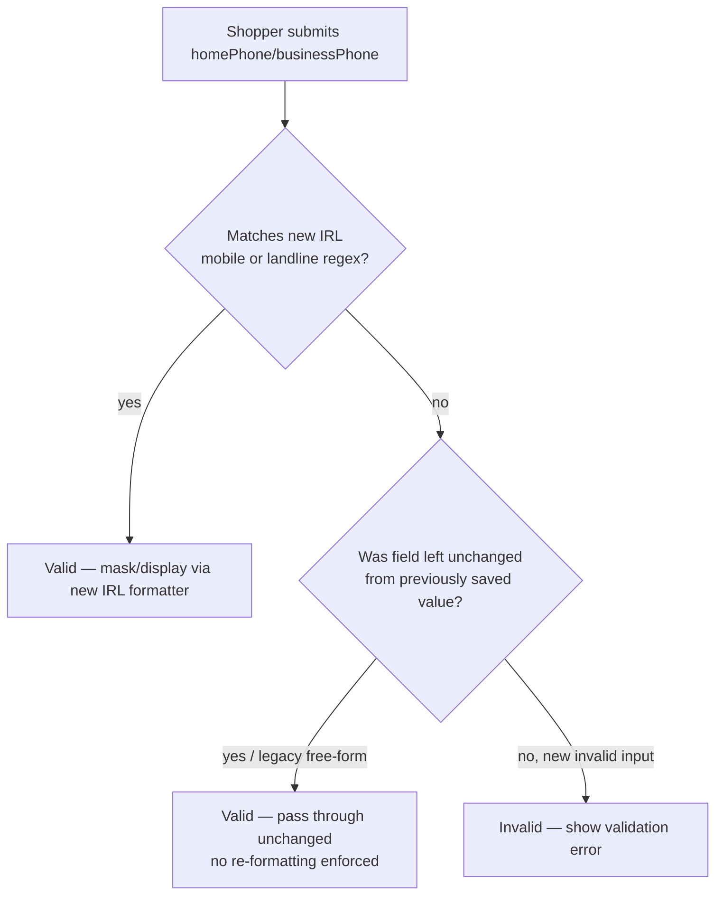

# IRL Phone Format Validation

> **Status**: Done (revised 2026-09-11 — see [§4 Revision](#4-revision--2026-09-11))
> **Created**: 2026-08-17

## 1. Business Context

### Problem Statement

Irish (`IRL`) phone numbers in the My Account profile form currently have no real format validation: `react/rules/IRL.js` registers the country but never wires any phone masking/validation into the `homePhone`/`businessPhone` fields.

A prior attempt to fix this tried to reuse `@vtex/phone`'s native country support (`initializeCountryPhone` + `getPhoneFields`, importing `@vtex/phone/countries/IRL`). That country module does not exist in the `@vtex/phone` package — Ireland was never shipped there — so that approach breaks the build/runtime and cannot be used. A self-contained implementation is needed instead of relying on the library's country registry.

Two valid Irish phone formats need to be recognized (mobile and Dublin landline). Any fix also needs to consider shoppers who already have a phone number saved under the current (unvalidated) regime: if the new validation is applied strictly, an existing shopper editing any profile field — even an unrelated one — could be blocked until they fix an old phone number that doesn't match the new pattern. The new formats must be accepted **in addition to** the previous unrestricted format, so existing data is never invalidated.

### Goals

- Recognize and correctly format the two valid Irish phone formats (mobile and Dublin landline) on the My Account profile form.
- Never invalidate a profile edit because of a phone number that was already saved before this fix (backward compatibility for existing shoppers).
- Ship the fix without depending on `@vtex/phone`'s country registry, since it has no Ireland definition.

### User Stories

#### US-1: New Irish phone number is recognized

- **Story**: As a shopper filling in my profile, I want my Irish mobile or Dublin landline number to be recognized as valid, so that I can save my profile without being blocked by generic/absent validation.
- **Acceptance Criteria**:
  - **Given** a profile form with `homePhone` (or `businessPhone`) empty, **when** the shopper enters `+353 87 123 4567`, **then** the field validates successfully and is masked/displayed consistently.
  - **Given** the same conditions, **when** the shopper enters `+353 1 123 4567`, **then** the field validates successfully and is masked/displayed consistently.

#### US-2: Existing shoppers are never blocked by the new rule

- **Story**: As a shopper who already has a phone number saved in the old, unrestricted format, I want to edit any other profile field without being forced to fix my phone number, so my existing data isn't broken by the new validation.
- **Acceptance Criteria**:
  - **Given** a profile already saved with a phone number that does not match either new IRL format, **when** the shopper edits an unrelated field (e.g. `firstName`) and submits, **then** the form validation does not fail because of the phone field.
  - **Given** the same profile, **when** the shopper does not touch the phone field at all, **then** the previously saved value is preserved unchanged.

#### US-3: No dependency on a non-existent library country module

- **Story**: As an engineer maintaining `profile-form`, I want IRL phone validation to not depend on `@vtex/phone`'s country registry, so the app doesn't fail to build/run because that package has no Ireland definition.
- **Acceptance Criteria**:
  - **Given** `react/rules/IRL.js`, **when** the module is loaded, **then** it must not import `@vtex/phone/countries/IRL` or call `initializeCountryPhone` for `IRL`.
  - **Given** the test/build pipeline, **when** it runs against this branch, **then** it passes without module-resolution errors related to IRL.

### Key Scenarios

| Scenario | Pre-conditions | Steps | Expected Result |
|---|---|---|---|
| Happy path — new mobile number | New profile, `homePhone` empty | Shopper enters `+353 87 123 4567` and submits | Field validates, is masked/displayed correctly, form saves |
| Error case — clearly invalid input | New profile, `homePhone` empty | Shopper enters non-numeric garbage (e.g. `abcxyz`) | Field fails validation, shopper is prompted to correct it |
| Edge case — legacy saved number, unrelated edit | Existing profile with phone saved in old free-form (pre-fix) format that doesn't match either new regex | Shopper edits `lastName` only and submits | Form saves successfully; phone field is not re-validated against the strict new format and is not altered |

### Functional Requirements

- `react/rules/IRL.js` must define custom `mask`/`validate`/`display`/`submit` behavior for `homePhone` and `businessPhone` instead of spreading `getPhoneFields(phoneCountryCode)` from `react/modules/phone.js`.
- `validate()` must return `true` for values matching either confirmed format (mobile `+353 8X XXX XXXX`, landline `+353 1 XXX XXXX`), accepting reasonable spacing variants, **or** for any previously-valid free-form value (backward-compat fallback), so no existing data is rejected.
- Must not import `@vtex/phone/countries/IRL` or call `initializeCountryPhone` for IRL.
- Change applies to the `3.x` release line (where `react/rules/IRL.js` exists today); base branch is `origin/3.x`.

### Non-Functional Requirements

- No behavior change for any country other than `IRL`.
- No added runtime dependency; implementation stays within `react/rules/IRL.js` (plain regex/string handling).
- Error messaging/UX for the phone field stays consistent with other country rule files.

### Out of Scope

- Adding native Ireland support to the `@vtex/phone` package itself.
- Retroactively cleaning up / re-formatting phone numbers already saved in the old format.
- Backend/OMS-side phone validation — this is Storefront `profile-form` UI validation only.
- Porting IRL rules to `master` (only `3.x` is in scope; `IRL.js` doesn't exist on `master` today).
- Changing the shared `validate` contract (`ProfileField`/`validateProfile.js`) to pass a field's initial/saved value alongside the current one. That would let `validate()` grandfather a value only when it is exactly unchanged, closing the shape-heuristic gap in Decision 2 — but it changes behavior for every country rule file, not just `IRL`, so it's tracked as a possible follow-up rather than done here.

---

## 2. Arch Decisions

### Proposed Solution

Implement a self-contained, custom `validate`/`mask` for the `homePhone` and `businessPhone` fields directly inside `react/rules/IRL.js`, using two explicit regex patterns for the confirmed formats (mobile and Dublin landline), OR-ed with a permissive fallback that accepts values that don't match either new pattern (covering legacy/free-form data already saved). This avoids any dependency on `@vtex/phone`'s country registry, which has no `IRL` definition.

### Architecture Overview

### Alternatives Considered

| Alternative | Pros | Cons | Verdict |
|---|---|---|---|
| Use `@vtex/phone` country registry (`initializeCountryPhone` + `getPhoneFields`) | Reuses existing helper shared by other countries | `@vtex/phone` has no `IRL` module; import fails at build/runtime | Rejected — this is exactly why the prior attempt failed |
| Strict validation matching only the 2 new formats | Guarantees canonical format going forward | Blocks existing shoppers from editing unrelated profile fields if their saved number doesn't conform | Rejected — conflicts with the confirmed business decision |
| Custom permissive regex validate/mask in `IRL.js` (new formats + legacy fallback) | Satisfies both asks: correct guidance for new entries, zero breakage for existing data; no dependency on missing library country | Legacy non-conformant numbers are never forced to normalize | **Accepted** |

### Risks & Mitigations

| Risk | Impact | Likelihood | Mitigation |
|---|---|---|---|
| Regex too strict, rejects valid spacing/format variants | Medium | Medium | Normalize input (strip spaces/dashes) before matching; test with variants before merge |
| Permissive fallback means malformed new input could slip through as "legacy" | Medium | High | Manually confirmed during testing (e.g. a digit string with a misplaced `+`, or an arbitrary ~15-digit number, was initially accepted). `validate()` has no access to the field's previously-saved value — it only ever sees the current value — so the fallback cannot truly tell "untouched legacy data" from "new free-form input"; it can only approximate via shape. Mitigated by tightening the shape check (single leading `+`, 7–15 digits, matching realistic subscriber-number length and E.164's max). This narrows, but does not eliminate, the acceptance window for new non-conforming input — accepted as a scoped trade-off to keep the fix contained to `IRL.js`. A fully precise fix would require comparing against the field's initial/saved value, which needs a shared change to the `validate` contract across `ProfileField`/`validateProfile.js` — out of scope here (see Out of Scope) |
| `master` line still has no IRL support at all | Low | Low | Out of scope for this fix; track as separate follow-up if a `master`-based store requests it |
| Confusion with a still-open, broken prior pull request attempting the same fix | Medium | Medium | Close that PR once this fix merges, referencing this spec/PR as the replacement |

### Key Decisions

#### Decision 1: Do not use `@vtex/phone`'s country registry for IRL

- **Status**: Accepted
- **Context**: `@vtex/phone` has no `IRL` entry under `countries/`, in any released version. Importing `@vtex/phone/countries/IRL` breaks build/runtime.
- **Decision**: Implement `homePhone`/`businessPhone` validation and masking as custom logic inside `react/rules/IRL.js`, without calling `initializeCountryPhone` or `getPhoneFields` for `IRL`.
- **Consequences**: Slightly more duplicated logic vs. countries backed by the library, but no broken dependency and no need to patch/wait on `@vtex/phone`.

#### Decision 2: Permissive validation — accept new formats + a bounded legacy shape

- **Status**: Accepted
- **Context**: Existing shoppers must not be blocked from editing their profile because of a phone number saved before this fix existed. `validate()` in this codebase only ever receives the current value — it has no access to what was previously saved — so "accept legacy data" can only be approximated by shape, not by an exact match against prior state.
- **Decision**: `validate()` accepts the two confirmed IRL formats for new/changed input. For anything else, it falls back to a bounded shape check: an optional single leading `+`, otherwise only digits/spaces/dashes/parentheses, with a total digit count between 7 and 15 (a realistic subscriber-number length, capped at E.164's maximum).
- **Consequences**: The two confirmed formats become the guided format for new entries; legacy data in a plausible phone shape is never retroactively invalidated or forced to reformat. This is a shape heuristic, not a guarantee — new input that happens to fit the same bounds is also accepted. A fully precise fix (only grandfather a value that is byte-for-byte what was already saved) would require passing the field's initial value into `validate`, a shared contract change across every country rule — out of scope for this fix.

#### Decision 3: Fix targets the `3.x` line, not `master`

- **Status**: Accepted
- **Context**: `react/rules/IRL.js` only exists on the `3.x` release line. It doesn't exist on `master`.
- **Decision**: Implement and ship this fix on a branch based on `origin/3.x`.
- **Consequences**: `master`/newer Storefront lines remain without IRL rules until a separate effort ports this forward, if ever requested.

### Implementation Plan

1. On a branch based on `origin/3.x`, update `react/rules/IRL.js`: keep existing `personalFields`/`businessFields`, add custom `mask`/`validate`/`display`/`submit` for `homePhone` and `businessPhone`.
2. Implement regex helpers for the two confirmed formats with input normalization (strip spaces/dashes) — no import of `@vtex/phone/countries/IRL`.
3. Add unit tests: new mobile format, new landline format, legacy/free-form existing value (must still validate), and a clearly invalid input case.
4. Manually verify via local render.
5. Open a PR against `3.x`, referencing this spec.

---

## 3. Technical Contract

### Data Models

No new data models. `homePhone`/`businessPhone` remain plain string fields on the `IRL` rule object, same shape used by every other country file (`ARG.js`, `GBR.js`, etc.): `{ name, maxLength, label, mask?, validate?, display?, submit? }`.

### Interfaces

- `react/rules/IRL.js` default export keeps the existing contract: `{ country: 'IRL', personalFields: [...], businessFields: [...] }`, consumed by the profile-form rules loader the same way as any other country file.
- Phone field spec for `homePhone`/`businessPhone`: `{ mask: (value: string) => string, validate: (value: string) => boolean, display: (value: string) => string, submit: (value: string) => string }` — implemented locally in `IRL.js` instead of via `getPhoneFields` from `react/modules/phone.js`.

### Integration Points

- Consumed by the existing profile-form rules resolver that picks `rules/<COUNTRY>.js` based on the shopper's locale/country — no changes needed there.
- No backend/API contract changes; this is front-end validation/masking only, scoped to Storefront My Account.

### Invariants & Constraints

- `validate()` must never reject a phone value that was accepted under the pre-existing (no-validation) regime.
- `validate()` must accept `+353 87 123 4567` and `+353 1 123 4567`, plus reasonable spacing variants of each.
- Must not import or depend on `@vtex/phone/countries/IRL`.
- Change is scoped to the `3.x` release line of `profile-form` only.

---

## 4. Revision — 2026-09-11

### Context

Field feedback after shipping the original version of this fix: shoppers were able to save `homePhone`/`businessPhone` in formats other than the two confirmed IRL formats, and were also able to save the field empty despite it being expected to be required. Root causes:

1. The permissive legacy-shape fallback from **Decision 2** (§2) — accepted at the time as a scoped trade-off — was, in practice, wide enough to accept new non-conforming input, not just genuinely pre-existing free-form data. This was flagged as a residual risk in the original Risks & Mitigations table and has now materialized as a reported issue.
2. `homePhone`/`businessPhone` were never marked `required: true` in `react/rules/IRL.js` (consistent with every other country rule file, none of which marks phone as required at this layer). `applyValidation()` (`react/modules/validateProfile.js`) only blocks an empty value when `field.required` is `true`, so an empty phone was never rejected.

### Decision 2 (superseded): remove the legacy fallback

- **Status**: Superseded — see original Decision 2 in §2 for historical context.
- **Decision**: `validate()` in `react/rules/IRL.js` now accepts **only** the two confirmed formats (mobile `+353 8X XXX XXXX`, landline `+353 1 XXX XXXX`, with reasonable spacing variants) or an empty value (empty is handled separately by `required`, see below). The permissive free-form/legacy shape fallback (`isLegacyPhone`, `LEGACY_PHONE_REGEX`, digit-count bounds) has been removed entirely.
- **Consequences**: A shopper who already has a phone number saved in the old, unrestricted format will now be blocked by the `INVALID_FIELD` phone error if they submit the profile form without first correcting the phone number — including when editing an unrelated field (e.g. `firstName`). This reopens the exact regression that the original Decision 2 was written to avoid (see US-2 in §1, now superseded). This trade-off was made deliberately, prioritizing "never accept a new non-conforming number" over "never re-surface an old one" — accepted as a conscious business decision, not an oversight. If the resulting support burden from blocked existing shoppers turns out to be unacceptable, the precise fix flagged as out-of-scope in the original version (passing the field's initial/saved value into `validate()`, a shared contract change across `ProfileField`/`validateProfile.js` and every country rule file) is the follow-up to revisit.

### Decision 4: mark `homePhone`/`businessPhone` as `required` in IRL

- **Status**: Accepted
- **Context**: The phone field was expected/communicated as required but was not enforced as such by the form.
- **Decision**: Both `homePhone` (personalFields) and `businessPhone` (businessFields) in `react/rules/IRL.js` are now declared with `required: true`. This only changes IRL — no other country rule file is touched, and no other country's phone field becomes required.
- **Consequences**: An empty phone value now produces `EMPTY_FIELD` via `applyValidation()`, consistent with how `firstName`/`lastName` already behave in this file. A shopper without a phone number on file will be required to enter one (in one of the two confirmed formats) the next time they touch the profile form.

### Updated Acceptance Criteria

- **Given** a profile form with `homePhone` (or `businessPhone`) containing a value that does not match either confirmed IRL format (new or previously saved), **when** the shopper submits the form, **then** the field fails validation with `INVALID_FIELD`.
- **Given** a profile form with `homePhone` (or `businessPhone`) empty, **when** the shopper submits the form, **then** the field fails validation with `EMPTY_FIELD`.
- **Given** a profile form with `homePhone` (or `businessPhone`) containing `+353 87 123 4567` or `+353 1 123 4567` (or a reasonable spacing variant of either), **when** the shopper submits the form, **then** the field validates successfully.
