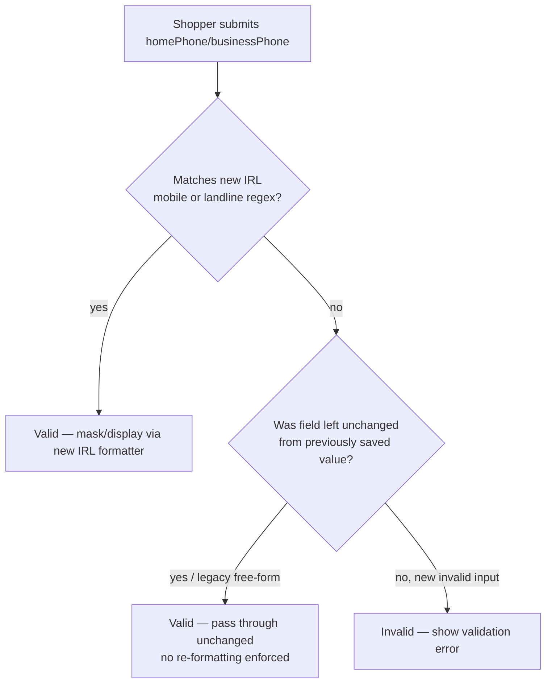

# IRL Phone Format Validation

> **Status**: Done
> **Created**: 2026-08-17

## 1. Business Context

### Problem Statement

Ticket [#1447585](https://vtexhelp.zendesk.com/agent/tickets/1447585) (Jira [OMS-9318](https://vtex-dev.atlassian.net/browse/OMS-9318), customer `dunnesstores`) reports that Irish (`IRL`) phone numbers in My Account have no real format validation today. `react/rules/IRL.js` on the `3.x` line registers the country but never wires phone masking/validation into the `homePhone`/`businessPhone` fields (the `getPhoneFields` spread added in PR #214 was never actually applied to those fields).

A previous attempt to fix this, PR #215 (`fix/restore-irl-phone-validation`), tried to add native support by importing `@vtex/phone/countries/IRL`. That country module **does not exist** in the `@vtex/phone` package (checked installed `v4.17.4` and its `CHANGELOG.md` — Ireland was never shipped there), so that PR breaks the build/runtime and cannot be merged as-is. This is the "deve ser feito de uma forma diferente" the customer/team flagged in the Slack thread — the fix needs a self-contained implementation instead of relying on the library's country registry.

The customer confirmed two valid formats and separately asked whether adding validation would affect **existing** customers who already have a phone number saved. Internal discussion (Gabriel Barros / Wagner Duarte) confirmed that yes — if validation is applied strictly, an existing shopper editing any profile field (even unrelated ones) would be blocked until they fix an old phone number that doesn't match the new pattern. The agreed direction is that the new formats must be accepted **in addition to** the previous unrestricted format, so existing data is never invalidated.

### Goals

- Recognize and correctly format the two confirmed Irish phone formats (mobile and Dublin landline) on the My Account profile form.
- Never invalidate a profile edit because of a phone number that was already saved before this fix (backward compatibility for existing shoppers).
- Ship the fix without depending on `@vtex/phone`'s country registry, since it has no Ireland definition.

### User Stories

#### US-1: New Irish phone number is recognized

- **Story**: As a `dunnesstores` shopper filling in my profile, I want my Irish mobile or Dublin landline number to be recognized as valid, so that I can save my profile without being blocked by generic/absent validation.
- **Acceptance Criteria**:
  - **Given** a profile form with `homePhone` (or `businessPhone`) empty, **when** the shopper enters `+353 87 123 4567`, **then** the field validates successfully and is masked/displayed consistently.
  - **Given** the same conditions, **when** the shopper enters `+353 1 123 4567`, **then** the field validates successfully and is masked/displayed consistently.

#### US-2: Existing shoppers are never blocked by the new rule

- **Story**: As a shopper who already has a phone number saved in the old, unrestricted format, I want to edit any other profile field without being forced to fix my phone number, so my existing data isn't broken by the new validation.
- **Acceptance Criteria**:
  - **Given** a profile already saved with a phone number that does not match either new IRL format, **when** the shopper edits an unrelated field (e.g. `firstName`) and submits, **then** the form validation does not fail because of the phone field.
  - **Given** the same profile, **when** the shopper does not touch the phone field at all, **then** the previously saved value is preserved unchanged.

#### US-3: No dependency on a non-existent library country module

- **Story**: As an engineer maintaining `profile-form`, I want IRL phone validation to not depend on `@vtex/phone`'s country registry, so the app doesn't fail to build/run because that package has no Ireland definition.
- **Acceptance Criteria**:
  - **Given** `react/rules/IRL.js`, **when** the module is loaded, **then** it must not import `@vtex/phone/countries/IRL` or call `initializeCountryPhone` for `IRL`.
  - **Given** the test/build pipeline, **when** it runs against this branch, **then** it passes without module-resolution errors related to IRL.

### Key Scenarios

| Scenario | Pre-conditions | Steps | Expected Result |
|---|---|---|---|
| Happy path — new mobile number | New profile, `homePhone` empty | Shopper enters `+353 87 123 4567` and submits | Field validates, is masked/displayed correctly, form saves |
| Error case — clearly invalid input | New profile, `homePhone` empty | Shopper enters non-numeric garbage (e.g. `abcxyz`) | Field fails validation, shopper is prompted to correct it |
| Edge case — legacy saved number, unrelated edit | Existing profile with phone saved in old free-form (pre-fix) format that doesn't match either new regex | Shopper edits `lastName` only and submits | Form saves successfully; phone field is not re-validated against the strict new format and is not altered |

### Functional Requirements

- `react/rules/IRL.js` must define custom `mask`/`validate`/`display`/`submit` behavior for `homePhone` and `businessPhone` instead of spreading `getPhoneFields(phoneCountryCode)` from `react/modules/phone.js`.
- `validate()` must return `true` for values matching either confirmed format (mobile `+353 8X XXX XXXX`, landline `+353 1 XXX XXXX`), accepting reasonable spacing variants, **or** for any previously-valid free-form value (backward-compat fallback), so no existing data is rejected.
- Must not import `@vtex/phone/countries/IRL` or call `initializeCountryPhone` for IRL.
- Change applies to the `3.x` release line (where `react/rules/IRL.js` exists today); base branch is `origin/3.x`.

### Non-Functional Requirements

- No behavior change for any country other than `IRL`.
- No added runtime dependency; implementation stays within `react/rules/IRL.js` (plain regex/string handling).
- Error messaging/UX for the phone field stays consistent with other country rule files.

### Out of Scope

- Adding native Ireland support to the `@vtex/phone` package itself.
- Retroactively cleaning up / re-formatting phone numbers already saved in the old format.
- Backend/OMS-side phone validation — this is Storefront `profile-form` UI validation only.
- Porting IRL rules to `master` (only `3.x` is in scope; `IRL.js` doesn't exist on `master` today).

---

## 2. Arch Decisions

### Proposed Solution

Implement a self-contained, custom `validate`/`mask` for the `homePhone` and `businessPhone` fields directly inside `react/rules/IRL.js`, using two explicit regex patterns for the confirmed formats (mobile and Dublin landline), OR-ed with a permissive fallback that accepts values that don't match either new pattern (covering legacy/free-form data already saved). This avoids any dependency on `@vtex/phone`'s country registry, which has no `IRL` definition.

### Architecture Overview

### Alternatives Considered

| Alternative | Pros | Cons | Verdict |
|---|---|---|---|
| Use `@vtex/phone` country registry (`initializeCountryPhone` + `getPhoneFields`, as PR #215 attempted) | Reuses existing helper shared by other countries | `@vtex/phone` has no `IRL` module; import fails at build/runtime | Rejected — this is the exact bug in PR #215 |
| Strict validation matching only the 2 new formats | Guarantees canonical format going forward | Blocks existing shoppers from editing unrelated profile fields if their saved number doesn't conform (per Wagner's concern) | Rejected — conflicts with confirmed business decision |
| Custom permissive regex validate/mask in `IRL.js` (new formats + legacy fallback) | Satisfies both asks: correct guidance for new entries, zero breakage for existing data; no dependency on missing library country | Legacy non-conformant numbers are never forced to normalize | **Accepted** |

### Risks & Mitigations

| Risk | Impact | Likelihood | Mitigation |
|---|---|---|---|
| Regex too strict, rejects valid spacing/format variants | Medium | Medium | Normalize input (strip spaces/dashes) before matching; test with variants before merge |
| Permissive fallback means malformed new input could slip through as "legacy" | Low | Medium | Accepted trade-off per business decision; scope fallback to preserve only unchanged/previously-stored values where feasible |
| `master` line still has no IRL support at all | Low | Low | Out of scope for this fix; track as separate follow-up if a `master`-based store requests it |
| Confusion with the still-open, broken PR #215 | Medium | Medium | Close PR #215 once this fix merges, referencing this spec/PR as the replacement |

### Key Decisions

#### Decision 1: Do not use `@vtex/phone`'s country registry for IRL

- **Status**: Accepted
- **Context**: `@vtex/phone` has no `IRL` entry under `countries/`, in any released version. PR #215 imports `@vtex/phone/countries/IRL`, which breaks build/runtime.
- **Decision**: Implement `homePhone`/`businessPhone` validation and masking as custom logic inside `react/rules/IRL.js`, without calling `initializeCountryPhone` or `getPhoneFields` for `IRL`.
- **Consequences**: Slightly more duplicated logic vs. countries backed by the library, but no broken dependency and no need to patch/wait on `@vtex/phone`.

#### Decision 2: Permissive validation — accept new formats + legacy free-form

- **Status**: Accepted
- **Context**: Existing shoppers must not be blocked from editing their profile because of a phone number saved before this fix existed.
- **Decision**: `validate()` accepts the two confirmed IRL formats for new/changed input, and does not reject values that don't conform when they represent previously accepted (free-form) data.
- **Consequences**: The two confirmed formats become the guided format for new entries; legacy data is never retroactively invalidated or forced to reformat.

#### Decision 3: Fix targets the `3.x` line, not `master`

- **Status**: Accepted
- **Context**: `react/rules/IRL.js` only exists on `3.x` (added by PR #214, merged there). It doesn't exist on `master`. The original `hotfix/irl-phone-validation` branch was based on `master` and therefore had nothing to fix.
- **Decision**: Implement and ship this fix on branch `fix/irl-phone-format-validation`, based on `origin/3.x`.
- **Consequences**: `master`/newer Storefront lines remain without IRL rules until a separate effort ports this forward, if ever requested.

### Implementation Plan

1. On `fix/irl-phone-format-validation` (based on `origin/3.x`), update `react/rules/IRL.js`: keep existing `personalFields`/`businessFields`, add custom `mask`/`validate`/`display`/`submit` for `homePhone` and `businessPhone`.
2. Implement regex helpers for the two confirmed formats with input normalization (strip spaces/dashes) — no import of `@vtex/phone/countries/IRL`.
3. Add unit tests: new mobile format, new landline format, legacy/free-form existing value (must still validate), and a clearly invalid input case.
4. Manually verify via local render against the examples from the ticket.
5. Open PR against `3.x`; reference this spec and close PR #215 as superseded.

---

## 3. Technical Contract

### Data Models

No new data models. `homePhone`/`businessPhone` remain plain string fields on the `IRL` rule object, same shape used by every other country file (`ARG.js`, `GBR.js`, etc.): `{ name, maxLength, label, mask?, validate?, display?, submit? }`.

### Interfaces

- `react/rules/IRL.js` default export keeps the existing contract: `{ country: 'IRL', personalFields: [...], businessFields: [...] }`, consumed by the profile-form rules loader the same way as any other country file.
- Phone field spec for `homePhone`/`businessPhone`: `{ mask: (value: string) => string, validate: (value: string) => boolean, display: (value: string) => string, submit: (value: string) => string }` — implemented locally in `IRL.js` instead of via `getPhoneFields` from `react/modules/phone.js`.

### Integration Points

- Consumed by the existing profile-form rules resolver that picks `rules/<COUNTRY>.js` based on the shopper's locale/country — no changes needed there.
- No backend/API contract changes; this is front-end validation/masking only, scoped to Storefront My Account.

### Invariants & Constraints

- `validate()` must never reject a phone value that was accepted under the pre-existing (no-validation) regime.
- `validate()` must accept `+353 87 123 4567` and `+353 1 123 4567`, plus reasonable spacing variants of each.
- Must not import or depend on `@vtex/phone/countries/IRL`.
- Change is scoped to the `3.x` release line of `profile-form` only.
